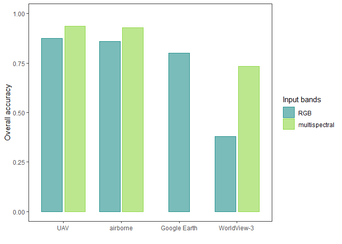
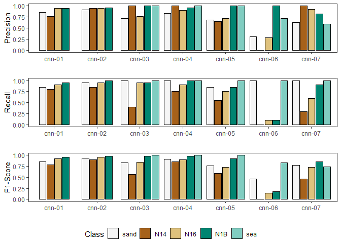
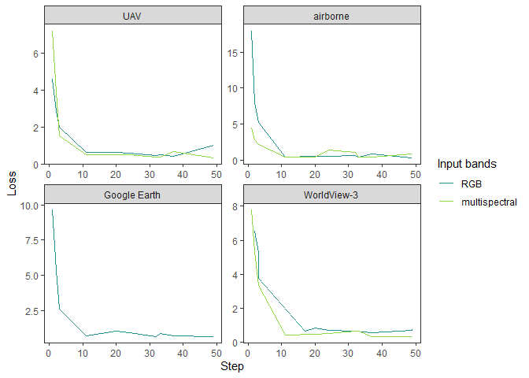

CNN results visualization
================

``` r
# load packages
library(ggplot2)
library(ggpubr)
library(viridis)
```

    ## Loading required package: viridisLite

### Overall accuracy

``` r
# load data
df <- read.csv("models/accuracy_metrics.csv", stringsAsFactors=TRUE)
df$source <- as.factor(df$CNN)
levels(df$source) <- c("uav", "uav", "air", "air", "ge", "wv", "wv")
df$bands <- as.factor(df$Image.Type)
df$bands <- factor(df$bands, levels = c("rgb", "multi"))

# graphical parameters
color_classes <- c("0"="#f5f5f5", "1"="#a6611a", "2"="#dfc27d", "3"="#018571", "4"="#80cdc1")
label_classes <- c("0"="sand", "1"="N14", "2"= "N16", "3"="N1B", "4"="sea")
theme_plot <- theme_bw() +
  theme(panel.grid.major = element_blank(), panel.grid.minor = element_blank())

# Overall accuracy
df_oa <- df[df$Metric=="Overall Accuracy", ]
df_oa[, c("CNN","Value")]
```

    ##        CNN     Value
    ## 1   cnn-01 0.8750000
    ## 26  cnn-02 0.9375000
    ## 51  cnn-03 0.8600000
    ## 81  cnn-04 0.9300000
    ## 111 cnn-05 0.8000000
    ## 141 cnn-06 0.3777778
    ## 171 cnn-07 0.7333333

``` r
levels(df_oa$source) <- c("UAV", "airborne", "Google Earth", "WorldView-3")
ggplot(df_oa) +
  geom_bar(stat="identity", aes(x=source, y=Value, col=bands, fill=bands), alpha=.6,width=.8,
           position=position_dodge2(preserve = "single", padding=.1)) +
  labs(x="", y="Overall accuracy") + ylim(0, 1) +
  scale_color_manual(values=c("#21908CFF", "#8FD744FF"), labels=c("RGB","multispectral"), name="Input bands")+
  scale_fill_discrete(type=c("#21908CFF", "#8FD744FF"), labels=c("RGB","multispectral"), name="Input bands")+
  theme_plot
```

<!-- -->

``` r
# ggsave("Fig4.png", bg="transparent", width=20, height=15, units="cm", dpi=600)
```

### Class-specific accuracy

``` r
# Class-specific accuracy
df_p <- droplevels(df[df$Metric=="Precision", ])
p1 <- ggplot(df_p, aes(x=CNN, y=Value, fill=Class))+
  geom_bar(stat="identity",position=position_dodge2(preserve = "single", padding=.1), color="black")+
  scale_fill_discrete(type = color_classes, labels=label_classes) + theme_plot + labs(x="", y="Precision")

df_r <- droplevels(df[df$Metric=="Recall", ])
p2 <- ggplot(df_r, aes(x=CNN, y=Value, fill=Class))+
  geom_bar(stat="identity",position=position_dodge2(preserve = "single", padding=.1), color="black")+
  scale_fill_discrete(type = color_classes, labels=label_classes) + theme_plot + labs(x="", y="Recall")

df_f <- droplevels(df[df$Metric=="F-Score", ])
p3 <- ggplot(df_f, aes(x=CNN, y=Value, fill=Class))+
  geom_bar(stat="identity",position=position_dodge2(preserve = "single", padding=.1), color="black")+
  scale_fill_discrete(type = color_classes, labels=label_classes) + theme_plot + labs(x="", y="F1-Score")

ggarrange(p1, p2, p3, nrow=3,  common.legend=T, legend="bottom")
```

<!-- -->

``` r
# ggsave("FigS6.png", bg="transparent", width=20, height=15, units="cm", dpi=600)
```

### Loss

``` r
# load data
df_loss <- read.csv("models/loss.csv", stringsAsFactors=TRUE)
df_loss$source <- as.factor(df_loss$CNN)
levels(df_loss$source) <- c("uav", "uav", "air", "air", "ge", "wv", "wv")
levels(df_loss$source) <- c("UAV", "airborne", "Google Earth", "WorldView-3")
df_loss$bands <- as.factor(df_loss$CNN)
levels(df_loss$bands) <- c("RGB", "multispectral", "RGB", "multispectral", "RGB", "RGB", "multispectral")

# Loss
ggplot(df_loss, aes(x=step, y=loss, col=bands)) +
  geom_line() +
  scale_color_manual(values=c("#21908CFF", "#8FD744FF"), name="Input bands") +
  theme_plot + labs(x="Step", y="Loss") +
  facet_wrap(~source, scales="free")
```

<!-- -->

``` r
# ggsave("FigS3.png", bg="transparent", width=18, height=10, units="cm", dpi=600)
```
